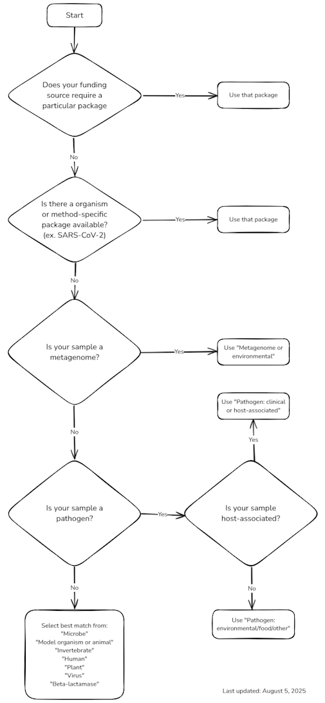

# Biosamples
{: .no_toc }

- **Table of Contents**
{:toc}

<!---
Sections start here
-->

## Choosing a BioSample Package

BioSample packages are collections of specimen metadata attributes tailored to specific methods and/or sequencing targets. Packages contain a core set of required attributes (ex. `collection_date`) and additional optional attributes which may be specific to a given BioSample package (ex. `ww_ph` in the [SARS-CoV-2: wastewater surveillance](https://submit.ncbi.nlm.nih.gov/biosample/template/?organism-organism_name=&organism-taxonomy_id=&package-0=SARS-CoV-2.wwsurv.1.0&action=definition) package). Choose the appropriate BioSample package most relevant to your sample(s) to be submitted. An Excel or TSV template can be downloaded for each BioSample package type during submission when using the web portal. A list of BioSample packages is available on [NCBI's website](https://www.ncbi.nlm.nih.gov/biosample/docs/packages/).

Below is a flowchart to aid in the selection of the appropriate BioSample package.

> **Guide for choosing a BioSample package:**
>
> 

{: .note }
> NCBI has additional BioSample packages that are unique to specific projects (MIGS, MIMAG, MIMARKS, MIMS, MISAG, MIUVIG). If your funding and data are not associated with any of these projects, it is OK to ignore these. More information can be found at: https://www.gensc.org/pages/standards-intro.html

## Frequent Metadata Issues

NCBI has developed detailed resources for compiling and formatting the necessary metadata to complete a submission, but first time submissions remain a challenging task for many laboratories. For comprehensive metadata requirements, we recommend the specific [documentation for BioSample packages](https://www.ncbi.nlm.nih.gov/biosample/docs/packages/).

Below, we list select metadata issues that frequently pose issues.

| Metadata Field | Issue |
| --- | --- |
| collection\_date | The best laid plans can be thwarted by Excel (and similar spreadsheet software). Ensure that date formats are not modified by Excel or other spreadsheet software to nonsensical numbers or decimals. The most unambiguous format to provide is [ISO 8601](https://en.wikipedia.org/wiki/ISO_8601) (YYYY-MM-DD) format. |
| geo\_loc\_name | This field must contain the designated format of `country:region`. [See this page for a list of acceptable options.](https://www.insdc.org/submitting-standards/geo_loc_name-qualifier-vocabulary/) |
| host | This field must contain the full taxonomic name of the species, for instance, `Homo sapiens`, not `Human`. Refer to [NCBI Taxonomy](https://www.ncbi.nlm.nih.gov/taxonomy) for specific terms. |
| host\_disease | This field must contain controlled vocabulary: [Home - MeSH - NCBI](https://www.ncbi.nlm.nih.gov/mesh/) |
| organism | As with `host`, the organism of the sample should include the complete and unabbreviated genus and species name. Please use the species name in the [NCBI taxonomy database,](https://www.ncbi.nlm.nih.gov/taxonomy/) if possible. If the species is unknown, provide the genus followed by `sp.` rather than a specific species name. |

## Missing Metadata Recommendations

There are many instances where NCBI's required metadata fields are not available or feasible to provide. In these cases, refer to the controlled vocabulary in your BioSample package template to determine the preferred way to note missing or withheld data for a given field. For required fields without a controlled vocabulary, consider using `not applicable` or `missing`.

{: .important }
> While compiling and formatting sequence metadata can be tedious and time consuming, it's important to provide as much metadata as possible when submitting public sequence data to NCBI. In general, **the less metadata accompanying a public sequence data submission, the less useful that sequence data will be to other researchers and public health initiatives.**

## Reducing Identifiability of Sequence Data

Providing accurate and complete sequence metadata is critical to making sequence data useful to others. While the sample collection date is sometimes considered potentially identifying information due to its association with human patients, it represents critically important epidemiological data about the pathogen itself. Specifically, the date the microbe stopped replicating and accumulating new mutations. For rapidly evolving pathogens like RNA viruses which typically acquire approximately one single nucleotide polymorphism every one to two weeks, reducing temporal resolution from days to months can significantly compromise phylogenetic analyses and outbreak investigations ([Dudas and Bedford, 2019 doi: 10.1186/s12862-019-1567-0](https://doi.org/10.1186/s12862-019-1567-0))

However, in some cases it may be necessary to withhold sample metadata to reduce the potential of data from being linked to an individual. While it is straightforward to withhold data from optional metadata fields, mandatory fields like collection date and collection location present a problem. One strategy is to provide a more general version of the specific piece of metadata, for example using `USA` for collection location rather than `USA:Minnesota` or using a collection date of `2025-03` instead of `2025-03-12`. Alternatively, jitter (a technique for decreasing identifiability of patient samples by minorly altering metadata) can be added to the collection date by adding or subtracting a few calendar days or rounding the collection date to the nearest Sunday/Monday. In cases where jitter is added, it's a good idea to note that the date was altered in a related free text field. In all cases, the **original unaltered metadata should be retained internally at your organization**.

## Real-World Examples

| BioSample Package | Organism | Link |
| --- | --- | --- |
| One Health Enteric | Influenza (agricultural) | https://www.ncbi.nlm.nih.gov/biosample/SAMN41749032 |
| Pathogen: clinical or host-associated | *Bordetella pertussis* | https://www.ncbi.nlm.nih.gov/biosample/SAMN46491808 |
| Pathogen: clinical or host-associated | *Candidozyma auris* | https://www.ncbi.nlm.nih.gov/biosample/SAMN48938922 |
| Pathogen: clinical or host-associated | Influenza (human) | https://www.ncbi.nlm.nih.gov/biosample/SAMN46122168 |
| Pathogen: clinical or host-associated | Mpox | https://www.ncbi.nlm.nih.gov/biosample/SAMN48179747 |
| Pathogen: clinical or host-associated | Mycobacterium tuberculosis | https://www.ncbi.nlm.nih.gov/biosample/SAMN46723454 |
| SARS-CoV-2: clinical or host-associated | SARS-CoV-2 | https://www.ncbi.nlm.nih.gov/biosample/SAMN39609935 |
| SARS-CoV-2: wastewater surveillance | SARS-CoV-2 Wastewater | https://www.ncbi.nlm.nih.gov/biosample/SAMN48971801 |
