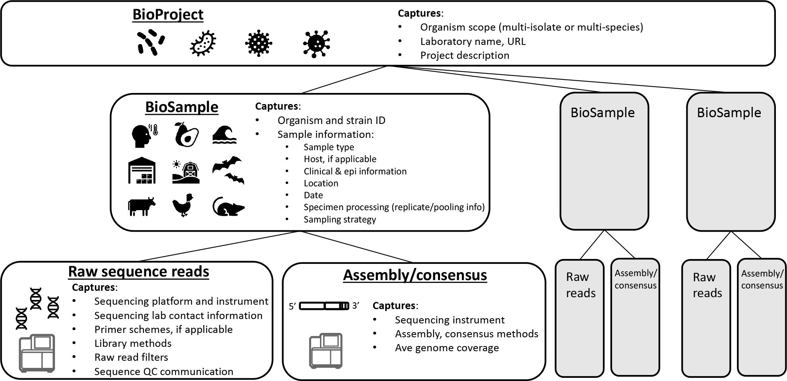

# Getting Started
{: .no_toc }

- **Table of Contents**
{:toc}

<!---
Sections start here
-->
## NCBI Structure

NCBI contains a wealth of biomedical and genomic information. Submitting sequence data to NCBI involves using and understanding the relationship between several resources:

* **GenBank/RefSeq** -  These resources primarily store assembled sequence data and metadata about how a sequence was assembled.
* **Sequence Read Archive (SRA)** - A database of raw sequencing reads.
* **BioSample** - Data about a biological specimen which was the starting point for sequencing.
* **BioProject** - An organizational structure that links data for a single research or surveillance project stored in other NCBI databases together.
  + **Umbrella BioProjects** are a special BioProject type that only contains other BioProjects.

These resources can be linked into a hierarchy:

* **Umbrella BioProjects** contain two or more other **BioProjects** that are related in some way.
* **BioProjects** contain **BioSamples** (and other NCBI database entries) that were created as a part of a specific research/surveillance effort.
* **BioSamples** contain data about a biological sample and are linked to **SRA** and/or **Genbank/RefSeq** entries.
* **SRA** entries contain raw sequence data and sequencing protocol metadata.
* **GenBank/RefSeq** entries contain assembled sequences and assembly procedure metadata.

> {: .note}
In some cases, limited metadata about the biological sample that was used to generate the sequence may also be included in a GenBak/RefSeq entry.

The figure below from Timme et al. (2023) shows the relationship between these resources graphically (excluding umbrella BioProjects):

> 
> Timme RE, Karsch-Mizrachi I, Waheed Z, et al. Putting everything in its place: using the INSDC compliant Pathogen Data Object Model to better structure genomic data submitted for public health applications. Microb Genom. 2023;9(12):001145. doi:[10.1099/mgen.0.001145](https://doi.org/10.1099/mgen.0.001145)

> **🔗Links**
> - [Putting everything in its place: using the INSDC compliant Pathogen Data Object Model to better structure genomic data submitted for public health applications]( https://pubmed.ncbi.nlm.nih.gov/38085797/)

## INSDC Federation: What if NCBI disappears?

Danny will write a blurb here

> **🔗Links**
> - [INSDC Website](https://www.insdc.org/)
> - [European Nucleotide Archive (ENA)](https://www.ebi.ac.uk/ena/browser/home)
> - [DNA Data Bank of Japan (DDBJ)](https://www.ddbj.nig.ac.jp/index-e.html)

## Limits on Batch Submission

Submitting sequencing data to NCBI databases in batches can greatly improve the efficiency and ease of uploading to public repositories, but there are a few limitations to be aware of. Namely, batch submissions using the web Submission Portal (either SRA or BioSample) can include only up to [1000 samples,](https://www.ncbi.nlm.nih.gov/sra/docs/submitportal/) however this limitation does not exist when submitting via FTP/XML. FASTQ files should be less than 100GB, and submissions in total should be less than 5TB.

In addition, all data submitted within a batch submission must be submitted to only one BioProject. Also, only [up to 400 genomes](https://www.ncbi.nlm.nih.gov/genbank/genomesubmit/#batch) may be submitted in a single batch to GenBank via the [Genome Submission Portal](https://submit.ncbi.nlm.nih.gov/subs/genome/) for Prokaryotic and Eukaryotic sequences. Most batch submissions must be of the same type, for example: a batch BioSample submission must all use the same BioSample package (don't mix packages in one submission). Eukaryotic Genome submissions must be separate from Bacterial submissions. Influenza A submissions must be separate from Influenza B, which must be separate from general non-special viral submissions (see below).

> **🔗Links**
> - [NCBI Genbank Submission Portal Documentation](https://www.ncbi.nlm.nih.gov/genbank/genomesubmit/)
> - [SRA Submission Portal](https://www.ncbi.nlm.nih.gov/sra/docs/submitportal/)

## Consideration on Institutional  Submission Frequency (!) 

> **🔗Links**

## Creating an NCBI Submission Group

By default, NCBI associates data with the individual NCBI account of the user who submitted the data. This approach is less than ideal for groups and institutions where the best long-term steward for the submitted data is the institution which generated the data rather than the individual who uploaded it. To address this, NCBI allows the creation of submission groups. Submission groups allow NCBI users to submit data under an organization rather than their individual account. Users can be added or removed from submission groups as needed, with the data remaining tied to the submission group regardless of user turnover.

The GenomeTrakr protocol "[NCBI submission protocol for microbial pathogen surveillance](https://www.protocols.io/view/ncbi-submission-protocol-for-microbial-pathogen-su-4r3l284pql1y/v11?step=1.2)" contains detailed step-by-step instructions for creating and administering an NCBI submission group.

{: .note}
The steps above can only be done once per NCBI account (i.e. each NCBI user account can only create one submission group on the NCBI website). If a user needs to create additional submission groups, they can request assistance by emailing [info@ncbi.nlm.nih.gov](mailto:info@ncbi.nlm.nih.gov).

> **🔗Links**
> - [GenomeTrakr NCBI submission protocol for microbial pathogen surveillance - Establish an NCBI submission user group for your laboratory]( https://www.protocols.io/view/ncbi-submission-protocol-for-microbial-pathogen-su-4r3l284pql1y/v11?step=1.2)

## Web Portal/FTP API Access 

> **🔗Links**
